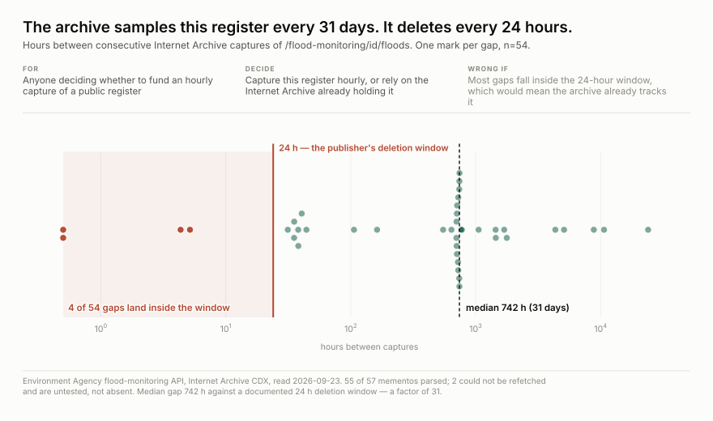
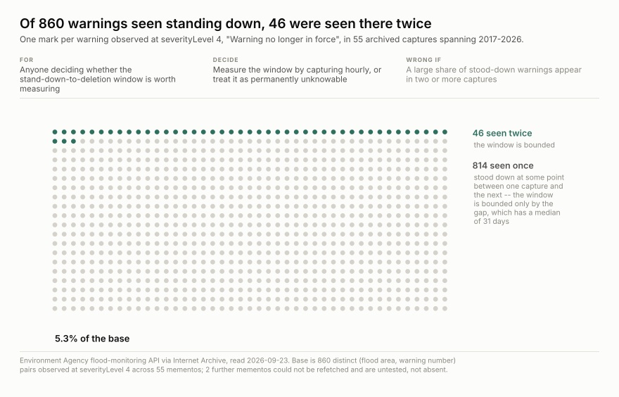

<h1 align="center">wss-flood-warnings</h1>

<p align="center">
  <strong>Live UK flood warnings, captured hourly because the publisher deletes them</strong>
</p>

<div align="center">

  <a href="https://github.com/q3dresearch/wss-flood-warnings/actions/workflows/capture-hourly.yml"></a>
  <a href="https://github.com/q3dresearch/wss-flood-warnings/commits"></a>
  <a href="https://github.com/q3dresearch/wss-flood-warnings/blob/main/LICENSE"></a>
  <a href="https://github.com/q3dresearch/wss-flood-warnings"></a>

</div>

<p align="center">
  <sub>fleet: <a href="https://github.com/q3dresearch/wss-engine">engine</a> · <a href="https://github.com/q3dresearch/wss-hugging-face">hugging face</a> · <a href="https://github.com/q3dresearch/wss-apify">apify</a> · <strong>flood warnings</strong> · <a href="https://github.com/q3dresearch/wss-forest-harvest">forest</a> · <a href="https://github.com/q3dresearch/wss-uk-food-safety">uk food safety</a></sub>
</p>

Every flood alert and warning the Environment Agency has in force for **England**:
severity, flood area, county, river or sea, tidal status, and when it was raised
and last changed. The agency documents its own deletion — a warning is set to
severity 4, *"Warning no Longer in Force"*, about 24 hours after it is raised, and
then **"the warning response is removed altogether"**.



**Nobody else is holding this.** The Internet Archive has 57 captures of the
warnings endpoint across 2017–2026 — one per 61 days against a 24-hour turnover,
and three in all of 2026. The EA's own archive holds 22 files, every one
`readings-*.csv`: river levels and rainfall, no warnings of any kind.

**Every source, its live URL, its licence and its last stored capture is listed in
[SOURCES.md](SOURCES.md)** — generated by `wss sources`, so it cannot drift from
the registry.

## The evidence nobody else is holding

**The Internet Archive has not covered it either, and here is the number.**
57 distinct captures of the warnings endpoint across 2017–2026:

| year | 2017 | 2018 | 2019 | 2020 | 2021 | 2022 | 2023 | 2024 | 2025 | 2026 |
| --- | ---: | ---: | ---: | ---: | ---: | ---: | ---: | ---: | ---: | ---: |
| captures | 11 | 18 | 13 | 1 | 3 | 0 | 0 | 2 | 6 | 3 |

One capture per 61 days against a 24-hour turnover. **Three captures in the
whole of 2026.** For contrast, the same measurement run against Apple's App
Store Review Guidelines returns about 1,950. Essentially every flood event
since 2017 is already gone.

**What is being lost is not small.** The largest memento the Archive did catch,
2020-02-17 during Storm Dennis, is 1,096,729 bytes and 760 live records:

| severity | records |
| --- | ---: |
| Flood Alert | 248 |
| Flood Warning | 193 |
| Warning no longer in force | 313 |
| Severe Flood Warning | 6 |

**Was this worth capturing?** Tested before the capture ran, against the Internet
Archive's own 55 mementos and using this repo's parser — see
[examples/research-questions.md](examples/research-questions.md). Three of the five
questions this data is for cannot be answered from the archive at all.

## Questions this exists to answer

| # | Question | Status |
| --- | --- | --- |
| Q1 | Does the Internet Archive already track this register? | **answered — no.** Median gap between captures is 742 h against a 24 h deletion window; 4 of 54 gaps fall inside it |
| Q2 | How long does a stood-down warning survive before it is deleted? | needs hourly captures. **This is the whole reason for capturing** — the archive bounds it for only 46 of 860 warnings (5.3%) |
| Q3 | Do the same areas flood repeatedly? | **answered as a floor** — 524 of 1,156 areas show more than one event, one of them 12 times |
| Q4 | Can a single reading stand for a week or a month? | **answered — no.** The register held 0 to 760 warnings across 55 captures, median 6 |
| Q5 | Can a warning's escalation path be reconstructed from the archive? | **answered — no.** 86.4% of warnings appear in exactly one capture |
| Q6 | Does the EA warn when the water is high, and where does it not? | accruing. Antecedent rainfall already explains a lot: Spearman **ρ 0.59** at a 3–10 day window, n=50. The **residual** is the EA's judgement, and that is what nothing else preserves |
| Q7 | Do warnings lead insurance claims or restoration demand? | **open, and untested** — no join has been attempted and no key overlap measured. Treat it as a hypothesis |

## What you can build

**[examples/research-questions.md](examples/research-questions.md) is the place to
start** — the backfill test, run against the archive's own 55 mementos using this
repo's parser, asking whether this capture is needed at all.



**Q2, drawn.** One mark per warning observed at severityLevel 4. The window is
bounded for the 46 in colour and unknown for the other 814.

## Using it

Reading this data needs nothing — no key, no account, not even a clone:

```bash
B=https://raw.githubusercontent.com/q3dresearch/wss-flood-warnings/main/derived/observations
duckdb -c "SELECT * FROM read_csv_auto('$B/2026-09.csv.gz') LIMIT 5"
```

```bash
python examples/load_observations.py     # sqlite + the five queries in queries.sql
python examples/backfill_stats.py <memento-dir>
```

`entity_id` is the `floodAreaID` (e.g. `053WAF113LWA`) — the identifier that
resolves to a published polygon. Metrics: `severity`, `severity_level`,
`description`, `county`, `river_or_sea`, `ea_area_name`, `ea_region_name`,
`is_tidal`, `time_raised`, `time_message_changed`, `time_severity_changed`,
`warning_id`, `polygon_url`, `message`, and `listed` — whose **absence** in a
later capture is the deletion.

## Why hourly, when the fleet floor is weekly

Because this source falsifies the rule rather than straining it. The fleet
samples from **how long a state persists**, not how often a publisher
republishes — and for wss-gho or wss-carbon-registry a state persists for
months, so weekly buys nothing over monthly. Here a state persists for about a
day. A weekly reading would catch roughly **one flood event in seven** and
report success on the other six.

The engine enforced the weekly floor in code until 2026-09-23. `hourly` was
added to `CADENCE_HOURS` for this source, and is offered **only** to sources
that can show the same thing: a documented or measured deletion window shorter
than a week. It is not a licence to poll anything else faster.

Hourly is affordable because the payload is honest: two fetches three seconds
apart are **byte-identical**, so there is no nonce, no served-at stamp and no
rotating id. Dedupe works with no `dedupe_ignore` at all, and an unchanged hour
costs one manifest line.

## An empty register is real data

Most hours of most years, nothing in England is flooding and the response is
703 bytes with `"items": []`. That is a measured national all-clear, **not a
failed fetch.** Nothing in the gates may require a flood field to be present;
what they require is the publisher's own metadata. And `max_shrink_pct` is set
to `100` — never fires — because the drop from a 1.1 MB storm to a 703-byte
quiet hour is a 99.94% shrink that happens after *every* flood event. A shrink
gate tight enough to be meaningful would quarantine exactly the captures that
record a flood **ending**.

## The entity is the flood area, not the warning number

`entity_id` is the `floodAreaID` (e.g. `053WAF113LWA`), because that is what
resolves to a published polygon with a county and a river — the identifier that
joins to geography and to a second flood at the same place years later. The
numeric warning id is carried as the `warning_id` metric instead.

**This has a cost, and it is paid up front:** two separate floods at one area
would otherwise look like a single long-lived entity. A changed `warning_id` at
an unchanged `floodAreaID` is a **new event**. Any series built from this must
break on `warning_id`, not on presence.

All three candidate keys were checked on the 760-record storm payload before the
parser was written: `floodAreaID`, `@id` and `(floodAreaID, timeRaised)` are each
760 distinct over 760 rows.

## Licence

The data is **Open Government Licence v3.0**, asserted by the publisher in
`meta.licence` on every response. Crawl permission was checked separately and
is a different question — see [LICENSE-DATA](LICENSE-DATA) for both, including
the robots evaluation.

> Contains public sector information licensed under the Open Government Licence
> v3.0. Source: Environment Agency flood-monitoring API.

## Layout

| path | what |
| --- | --- |
| `registry/ea.flood.warnings.yml` | the source definition, gates, and the reasoning |
| `parsers/floodwarning_v1.py` | schema `floodwarning.v1` → observations |
| `raw/`, `manifest/` | captured bytes and the append-only capture log |
| `derived/observations/` | long-format CSV, one row per metric per area per capture |
| `examples/queries.sql` | the five questions this data was captured to answer |
| `examples/research-questions.md` | the backfill test: what the archive can and cannot answer |
| `examples/artifacts/` | the four figures behind that test, and the scripts that build them |

Derive runs weekly, so `derived/` lags the raw captures. The raw is hourly and
committed hourly; run `wss derive` locally for anything fresher.
