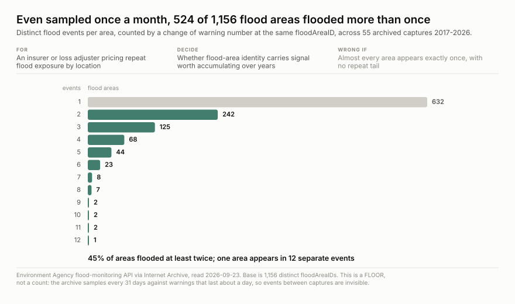
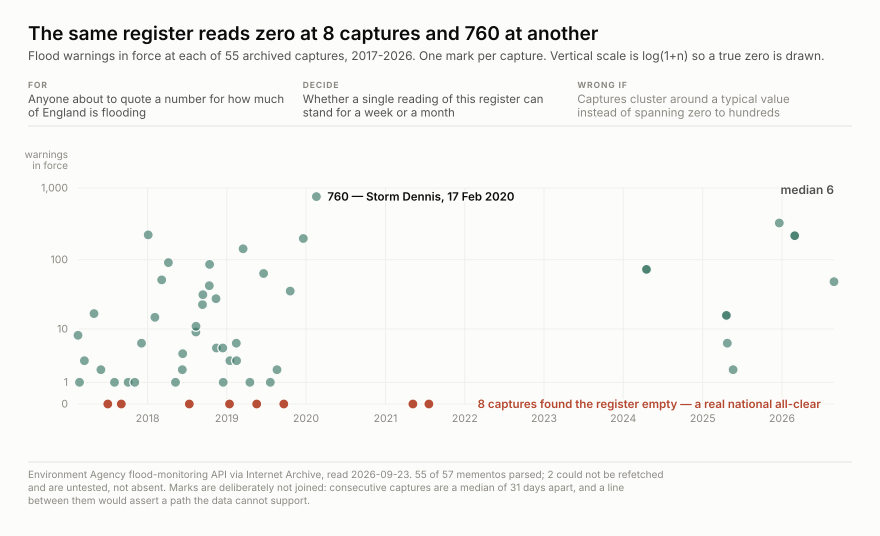

# Is this register worth capturing? — the backfill test

*Written for whoever has to approve running an hourly job for years.*

The claim that justifies this repo is that nobody else holds this data. That is a
falsifiable claim, and the Internet Archive is the thing most likely to falsify it. So
before the capture runs, its own archive was tested against the questions it proposes
to answer.

## Method

Every Internet Archive memento of `/flood-monitoring/id/floods` was fetched and parsed
with **this repo's own parser**, `parsers/floodwarning_v1.py` — not a parallel one
written to flatter the result. `artifacts/scripts/backfill_stats.py` reproduces it:

```
python3 artifacts/scripts/backfill_stats.py <memento-dir> --out stats.json
```

**55 of 57 mementos parsed, spanning 3,482 days.** Two could not be refetched after
five attempts (one connection reset, one HTTP 400) and are recorded as **untested, not
absent**. Six more were nearly lost to a bug worth naming: Wayback served them
`Content-Encoding: gzip`, and a naive `body[:1] in (b"{", b"[")` check discarded them as
non-JSON. They were 326, 217, 217 and 49 records and all from 2025–26, so throwing them
away would have made recent coverage look far thinner than it is.

**Every count below is a floor.** The instrument being used to measure the gap is the
sparse thing the gap is about.

## Verdict: yes, and the reason is narrow

Three of the five questions this data is for **cannot be answered from the archive at
all**, and one of them is the register's defining behaviour. One question the archive
*can* answer comes back positive, which is what makes the capture worth accumulating
rather than merely possible.

| # | question | status | number |
| --- | --- | --- | ---: |
| RQ1 | Does the archive already track this register? | **no** | 4 of 54 gaps ≤ 24 h |
| RQ2 | How long does a stood-down warning survive before deletion? | **needs capture** | bounded for 46 of 860 |
| RQ3 | Do the same areas flood repeatedly? | **yes, already** | 524 of 1,156 |
| RQ4 | Can one reading stand for a week or a month? | **no** | 0 to 760, median 6 |
| RQ5 | Can a warning's escalation path be reconstructed? | **needs capture** | 86.4% seen once |

---

### RQ1 — Does the Internet Archive already track this register?

**No, by a factor of 31.** Median gap between consecutive captures is **742 hours — 31
days** — against a deletion window the publisher documents as about 24 hours. Only **4 of
54** gaps fall inside that window. The largest gap is 1,002 days.


*Falsifier: most gaps landing inside the 24-hour window. They do not.*

### RQ2 — How long does a warning sit at "no longer in force" before it is deleted?

**This is the register's defining behaviour and the archive cannot measure it.** Bounding
the window needs the *same* warning observed at severityLevel 4 in at least two captures.
Across ten years that happened for **46 of 860** stood-down warnings — **5.3%**.


For the other 814, all that is known is that the warning stood down somewhere between one
capture and the next, and the median gap is 31 days. **Hourly capture answers this
directly**: the count of consecutive captures at severityLevel 4 *is* the window. Query 2
in [queries.sql](queries.sql).

*Falsifier: a large share of stood-down warnings appearing in two or more captures.*

### RQ3 — Do the same flood areas flood repeatedly?

**Yes, and this is the positive case for accumulating.** Even sampled once a month,
**524 of 1,156** areas (45%) show more than one distinct event, counted by a change of
warning number at the same `floodAreaID`. One area appears in 12 separate events.



Read this as a **floor with a known bias**: 42 of 55 mementos fall in 2017–19, so the
repeat structure is measured mostly on those years, and every event between captures is
invisible. The real figure is higher and this sample cannot say by how much.

*Falsifier: almost every area appearing exactly once, with no repeat tail.*

### RQ4 — Can a single reading stand for a week or a month?

**No.** Across 55 captures the register held anywhere from **0 to 760** warnings, median
**6**. Eight captures found it completely empty.



Those eight zeros are a **measured national all-clear, not a failed fetch** — which is
why nothing in the registry's gates may require a flood field to be present, and why
`max_shrink_pct` is 100. A shrink gate tight enough to be meaningful would quarantine
exactly the captures that record a flood *ending*.

*Falsifier: captures clustering around a typical value instead of spanning zero to hundreds.*

### RQ5 — Can a warning's escalation path be reconstructed from the archive?

**No.** Of 2,305 distinct warnings ever observed, **1,991 (86.4%) appear in exactly one
capture.** A single observation gives a severity but no trajectory: it cannot say whether
an alert became a warning, how fast, or whether it was ever severe. The archive holds
isolated frames, not sequences.

---

## Not tested here

The demand this was found against (`demand/needs.csv` p01) is *"where did damage just
happen at scale, and how soon will the claims land?"* — which needs flood warnings joined
to a claims or restoration-demand series. **No such join has been attempted and no key
overlap has been measured.** Until it is, the predictive claim is a hypothesis, not a
finding, and nothing here should be read as supporting it.

## What would change the verdict

Stop the capture if the Environment Agency publishes a warnings archive of its own, or if
Internet Archive coverage of this endpoint rises above roughly one capture a day. Both are
checkable with `backfill_stats.py` against a fresh CDX pull, and both would make this repo
redundant rather than merely less useful — which is the outcome to hope for.
